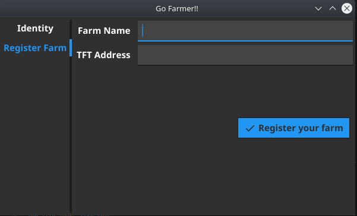

# Go Farmer!!


Simple fyne app to register farms on threefold grid


## identity registration


It's required to register an identity on the tfgrid explorer
requires:
- 3bot Name: alphanumeric ending with `.3bot`
- email
- words (mnemonics): if left empty it will get generated

## farm registration


for the farm all you need is 
- farm name: alphanumeric
- tft wallet address

## listing / editing farms 


Can list all of your farms and edit them (mainly the wallet address is what is interesting to you)
## listing nodes / inspecting details


Can list all nodes and show the important details

## dark/light mode support


`Go farmer` now supports dark/light modes 
## running

- clone `https://github.com/xmonader/gofarmer`
- `go build`
- run using `./gofarmer`

### building 
- please note on ubuntu you may need to execute `sudo apt install libxxf86vm-dev`

## notes

seed file should exist or gets generated in `~/.config/tffarmer.seed`

the file looks like this:
```
"1.1.0"{"mnemonic":"some words","threebotid":2201}%   
```


